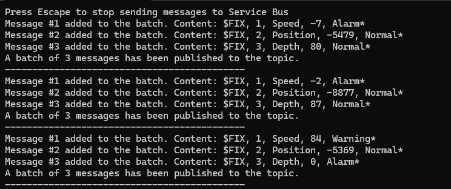
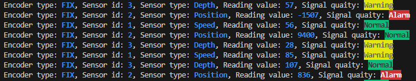

# Kongsberg-Maritime-recruitment-task

Kongsberg Maritime Software Engineer Recruitment Task

# Technology

##   

.NET program uses **Microsoft Azure Service Bus Topics and Services** to gather sensor messages and pass them through to receivers.

##   

Node.js script using **Express**, **TypeScript** and **@azure/service-bus** package for MS Azure Service Bus connection.  
Node.js version: `v20.12.2`  
npm version: `10.5.0`

## Service Bus setup

There's service bus with one **Topic** created in the Azure portal. The Topic has **3 Subscriptions** set up, one for each sensor. Each Subscription use correlation filter which evaluates messageId key and its value.

# How to run the project

## .NET

1. Input application secrets for `Microsoft.Extensions.Configuration` in `secrets.json` file.

```javascript
{
  "namespaceConnectionString": "<CONNECTION_STRING>",
  "topicName": "<TOPIC_NAME>"
}
```

2. Build the solution and run it.
3. The console will appear informing which baches of data has been sent to Service Bus.



## Node.js

1. Copy `.env_default` file and change its name to `.env`.
2. Input port on wich you want your app to be run on (`3000` is default) and application secrets in `.env` file.
3. Go inside `node` folder and run:  
   `npm install`  
   `npm run dev`
4. If the .NET application is running and sending messages, then Node.js app will log received sensor messages in the console.


